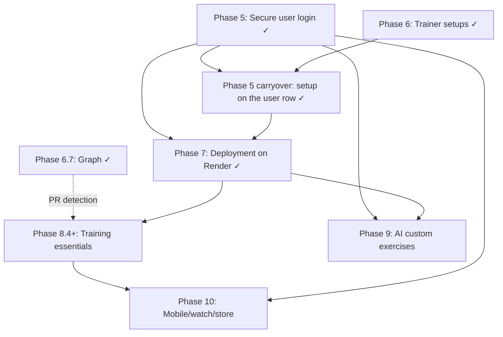

# Roadmap

Technical plan for taking Body Shop from a single-user local Flask app to a hosted,
multi-user product.

This file now tracks only the current, prioritized path forward. The implementation
history and retired tradeoffs live in [ARCHITECTURE.md](ARCHITECTURE.md).

Current state: **Phases 1, 2, 3, 4, 4.5, 5 (including its carryover), 6, 6.5, 6.7, 7 and
8.1–8.3 are done**, and
**Phase 9 was absorbed into Phase 2**. The app already has Tailwind v4 + daisyUI, 873
exercises with images across 12 muscle groups, Alembic migrations on SQLite/Postgres,
per-set weight/reps/RPE, the `/progress` training graph, trainer presets that scale the
weekly targets, equipment-aware logging, personal bests estimated from the user's own
sets, Supabase-backed accounts with `user_id` on every row and the trainer setup stored
against them, suggested routines, one shared set grid, the calendar folded into
`/summary`, and a deployment on Render with the launch floor behind it — CSV export, a
privacy policy, error monitoring and a documented restore drill.

## Prioritized roadmap

**Phase 5 carryover — the trainer setup's home. ✅ shipped.**
The Phase 6 setup moved off `localStorage` and onto three nullable columns on `user`,
read through `api._user_profile` and written by `GET`/`PUT /api/profile`. The
`experience`/`sessions`/`minutes` query parameters are gone from `/api/summary/week`
and `/api/progress/graph`: two sources of truth let a stale client be graded against
something other than its account's setup, invisibly, since both answers render
correctly.

The one thing worth knowing: **the columns are nullable and were not backfilled**, so
all three NULL still means *never chosen* — which is not the same fact as chose-the-
defaults, and is exactly what the first-run dialog reads to decide whether this account
has already answered. `localStorage` survives as a cache of the server's answer, which
is what keeps `loadProfile()` synchronous for `setgrid.js`'s RPE gate. The roadmap
predicted "the API shape does not change"; the payloads did not, but something had to
write the column.

**Phase 7 — Stack decision and deployment. ✅ shipped.**
Flask stayed and Render hosts it; Postgres lives in the Supabase project that
already held auth, so there is one vendor and one backup story. The runbook is
[OPERATIONS.md](OPERATIONS.md).

**Vercel was declined on record**, which is what this phase asked for. This is a
long-lived WSGI process with a migration step, and serverless buys nothing for it.
Every accommodation the repo already carried for that shape — `NullPool`,
`prepare_threshold=None`, a side-effect-free `create_app` — survives only because it
is *also* correct behind a connection pooler, which is how Supabase serves Postgres.

Two things worth knowing before touching the deployment:

- **Migrations are not a deploy hook.** `preDeployCommand` is paid-tier, and DDL
  through a transaction-mode pooler is not something to rely on, so they run from the
  operator's machine against the session pooler (5432) while the app uses the
  transaction pooler (6543). A service that boots against an unmigrated database
  serves 500s from every authenticated route — and `/healthz` still answers 200,
  because it deliberately opens no connection.
- **The free tier sleeps after 15 minutes idle**, and the next request pays roughly a
  50-second cold start. That is bad for an app opened mid-set, and it is documented
  rather than hidden: `plan: starter` is a one-line upgrade in `render.yaml`.

The launch floor landed with it: CSV export (`GET /api/entries/export.csv`, the whole
log, one row per set), a privacy policy that names jsDelivr as well as the obvious
vendors, Sentry behind an optional DSN with PII off, and a restore drill written down
with a dated line recording when it was last run.

### 1. Phase 8 — Training essentials

This is the parity phase. It should make the app feel complete next to mature trackers.
Broken into steps that can each ship on their own, roughly in dependency order.
**8.1, 8.2 and 8.3 have shipped**; what remains is 8.4 onward.

**8.1 — Suggested routines. ✅ shipped.**
A curated set of routines someone can follow, rather than a blank log.

- Each routine focuses on one thing and says so: a push day, a pull day, legs, a
  beginner full body, an athletic whole-body session.
- Each carries a **time estimate** derived from its prescribed sets, not typed in by
  hand, so it cannot drift from the exercises listed.
- Each exercise shows its photographs and how to do it, next to a **log button** that
  writes straight into the week.
- Routines are *editorial content in code*, validated at import against the catalog —
  the same contract `STAPLE_EXERCISE_IDS` has. They are not user data and not a
  schema change.

**8.2 — One set grid, two entrances. ✅ shipped.**
The quick-log on a routine must be the *same* thing as `/log`, not a lesser cousin.

- Extract the set grid out of `log.js` into a component both pages mount.
- Weight modes, added weight, the RPE gate, plate hints, the repeat button and the
  rest timer all come along, because they are the grid rather than the page.

**8.3 — The calendar folds into the weekly summary. ✅ shipped.**
A whole chapter for a month grid was more room than the feature earned.

- `/summary` gains a week strip that expands to the month and collapses again.
- `/calendar` retires and redirects; the shelf it occupied becomes Routines.

**8.4 — Entry and set editing.**
Currently append-only: a mistake is deleted and re-logged.

- `PATCH /api/entries/<id>` and per-set edits, reusing `validate_sets`.
- The set grid already renders values rather than placeholders when asked, so the
  editing surface is the component from 8.2 mounted against an existing entry.

**8.5 — PR detection.**
6.7 estimates a best per *window*; nothing records one when it happens.

- Store a best per exercise, or derive it over all time and diff on write.
- Announce it in the log flow, once, without turning the app into a slot machine.

**8.6 — Body metrics.**
Bodyweight is the column a strength standard would need, if the product ever wants
one — and the one that makes a bodyweight lift measurable.

- A `body_metric` table plus a migration; weight and date, nothing more to start.
- It would let `/progress` size bodyweight movements instead of ringing them.

**8.7 — Per-exercise progress graphs.**
One movement over time, rather than the whole constellation.

- Estimated 1RM and volume per session, from data that already exists.

Throughout: keep the volume-coverage model intact. None of this may turn the app into
a strength-standards tracker (see docs/VOLUME_SCIENCE.md §3.5).

### 2. Phase 9 — AI-assisted custom exercises

Only build this after the catalog has been in front of real users long enough to show
what it misses.

- Measure the miss rate before building.
- Classify into the existing muscle and facet vocabulary.
- Require user review before saving any AI suggestion.
- Log corrections so the prompt can be tuned against real misses.

### 3. Phase 10 — Mobile, watch, and store distribution

This is last because it consumes the earlier phases.

- Ship a native client or a truly native-capable shell, not a wrapped website.
- Support offline queueing and replay.
- Add watch logging and rest timers.
- Close the store requirements: privacy policy, privacy labels, data safety, and
  account deletion.

## Already shipped

- Phase 1: Tailwind + DaisyUI, CSS-only build step.
- Phase 2: exercise catalog and muscle map, with images folded in.
- Phase 3: Alembic migrations and Postgres support.
- Phase 4: set-level logging, derived volume, previous values, rest timer, plate
  calculator.
- Phase 4.5: dark redesign and the `/progress` training graph.
- Phase 5: accounts. Supabase Auth over plain `fetch` from the browser, bearer tokens
  verified in [app/services/auth.py](../app/services/auth.py), a mirrored `user` table
  created just-in-time on the first authenticated request, `user_id` as the first
  positional argument of every query that touches an entry, five bare auth pages, and
  `DELETE /api/account`. The postscript at the foot of this file records the three
  divergences from the SQL sketch and what was deliberately not built.
- Phase 6: trainer setups (beginner / experienced / advanced) and workout-length
  sizing, in [app/training.py](../app/training.py). The two inputs combine with
  `min` rather than by multiplying — **your target is the smaller of what your
  experience asks for and what your week can hold** — because training fewer hours
  *is* how a beginner's lower volume shows up, and charging for both double-counts
  it. RPE is the advanced setup's field. Nothing falls below four sets a week, the
  literature's floor for a muscle responding at all.
- Phase 6.5: equipment-aware logging. `weight_mode` is derived from a movement's
  equipment in [app/exercises.py](../app/exercises.py), and it decides what the
  weight column is called, whether a plate breakdown is offered at all, and whether
  the field is asked for. Body-only movements get an "Added weight" toggle instead of
  a weight box, and there is a repeat-set button.
- Phase 6.7: the graph draws from the first logged movement instead of switching on at
  fifteen, and node size answers either "how much work" or "how heavy" — the latter
  estimated from the user's own sets in
  [app/services/strength.py](../app/services/strength.py). **A movement with no
  recorded load draws as a hollow ring rather than a small node**, which is the rule
  `graph.py` wrote down before the data to break it existed. A strength *standard* is
  still out: no bodyweight is stored and no one is compared to anyone.
- Phase 7: deployment. Flask on Render (`render.yaml`), Postgres in the Supabase
  project that already held auth, and the launch floor with it — `GET
  /api/entries/export.csv`, a `/privacy` page that names jsDelivr as well as the
  obvious vendors, Sentry behind an optional DSN, and a restore drill in
  [OPERATIONS.md](OPERATIONS.md). `GET /healthz` opens no database connection on
  purpose: a health check that queried Postgres would turn an outage into a restart
  loop. Vercel was declined on record.
- Phase 8.1–8.3: suggested routines as editorial content in code, the set grid
  extracted into one component both `/log` and a routine's quick-log mount, and the
  calendar folded into a strip on `/summary` — `/calendar` is a 301 and the shelf it
  held became Routines.
- First run: one question, once (`app/static/js/onboarding.js`), so the trainer setup
  is the user's rather than a guess about a stranger. Never on `/` or `/how-to-use`.

## Later, if the product earns it

- Auto-progression and programming.
- Social features.
- Nutrition tracking.
- Recovery-aware programming.
- Conversational AI coaching.

## Dependency shape

The live chain is simple:

Phase 5 gated ownership and account deletion, and it has landed; the one loose end
Phase 6 left — the trainer setup living in `localStorage` rather than on the account —
is closed too. Phase 7 gated launch and has landed, so the app is deployable and
deployed rather than deployable in principle. Phase 8 is
the competitive parity floor, and 8.1–8.3 of it are already in. Phase 9 depends on
actual usage. Phase 10 depends on all of the above — and inherits Phase 7's privacy
policy and account deletion, which is two of its store requirements already met.

---

## Phase 5 — what shipped, and where it diverged

Shipped: Supabase Auth with bearer tokens, a mirrored `user` table, `user_id` on
every entry query, five bare auth pages, `GET /api/me` and `DELETE /api/account`.

**Three divergences from this document's own SQL sketch**, all forced by
choosing a provider over self-hosting:

| Sketch | Shipped | Why |
| --- | --- | --- |
| `id INTEGER PRIMARY KEY` | `Uuid(as_uuid=False)` | It is not our id. It is `auth.users.id`, a UUID. |
| `password_hash TEXT NOT NULL` | absent | Supabase holds it. A local copy is a credential we chose not to own. |
| `verified_at TEXT` | absent | Supabase's `email_confirmed_at` is the truth; a mirrored copy drifts invisibly. |

**A cost this phase's estimate had not priced in:** the suite runs offline
against per-test SQLite files, and an external issuer in the middle of every
authenticated test would have ended that. Bought back with the dual key
resolver — testing config pins `SUPABASE_JWT_SECRET`, so the HS256 branch always
wins and tokens are minted in-process.

**Open decisions closed:** 3 (auth provider → Supabase, bearer tokens);
2 (mobile → token auth ✓, in-app deletion ✓); 5 (existing data → wiped by
revision `0005`, irreversibly).

**Deliberately not built:** Flask-Limiter and Redis (Supabase rate-limits its own
endpoints; ours is bearer-only with no credential to brute-force), CSRF
(dissolved by the token choice — no cookies anywhere), server-side page gating
(Flask cannot read a header the browser does not send on a navigation), and
enumeration hygiene, lockout and password strength (all Supabase dashboard
settings).

**Still open from this phase:** the trainer setup did not move onto the user row —
`user` carries `id`, `email` and `created_at` and nothing else. It is the first
item in the prioritized list above.

Phase 8.6's `body_metric` and Phase 9's `custom_exercise` inherit the pattern: a
FK to `"user"(id)` with `ON DELETE CASCADE`, and `DELETE /api/account` keeps
working with no change.
