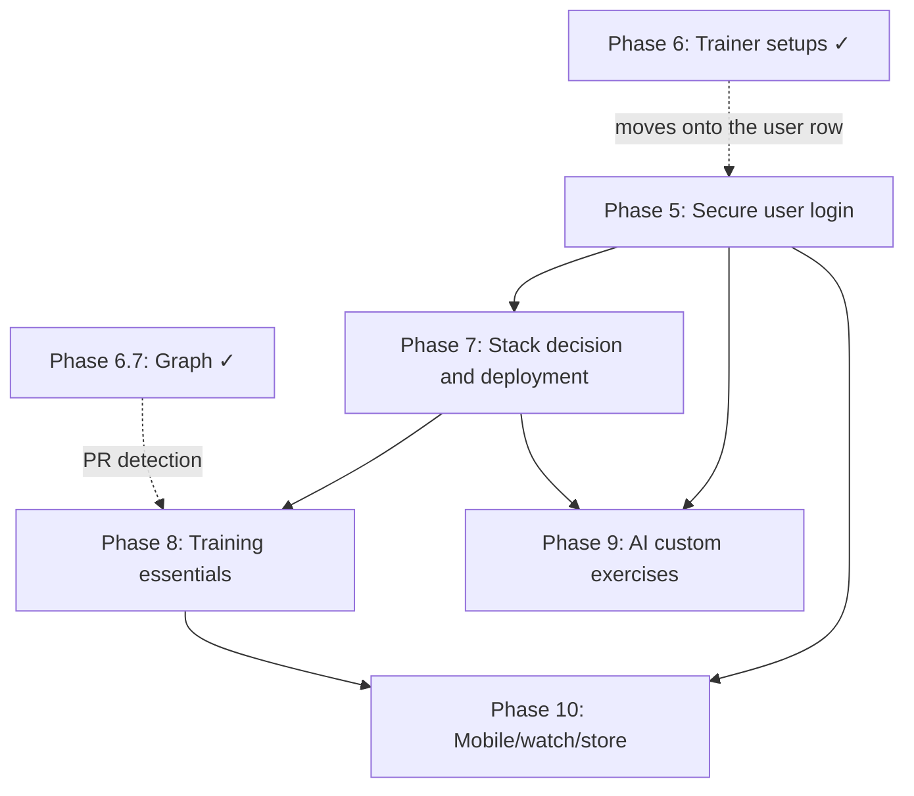

# Roadmap

Technical plan for taking Body Shop from a single-user local Flask app to a hosted,
multi-user product.

This file now tracks only the current, prioritized path forward. The implementation
history and retired tradeoffs live in [ARCHITECTURE.md](ARCHITECTURE.md).

Current state: **Phases 1, 2, 3, 4, 4.5, 6, 6.5 and 6.7 are done**, and **Phase 9 was
absorbed into Phase 2**. The app already has Tailwind v4 + daisyUI, 873 exercises with
images across 12 muscle groups, Alembic migrations on SQLite/Postgres, per-set
weight/reps/RPE, the `/progress` training graph, trainer presets that scale the weekly
targets, equipment-aware logging, and personal bests estimated from the user's own
sets.

Phase 6 shipped **ahead of** Phase 5, which the dependency graph put first. The trainer
setup needs somewhere per-user to live and there is no user yet, so it lives in
`localStorage` and rides along with the request; Phase 5 moves it onto the user row
without changing the API's shape. That is the only part of the ordering that was
inverted, and it is reversible.

## Prioritized roadmap

### 1. Phase 5 — Secure user login

This is the next hard dependency. Everything user-owned depends on it.

- Add ownership to every user data model and query.
- Decide auth with a strong default toward Supabase Auth + bearer tokens.
- Add in-app account deletion and a migration/backfill plan for existing rows.
- Keep the CSRF and cookie-session question aligned with the auth choice.
- Move the Phase 6 trainer setup off `localStorage` and onto the user row. The API
  already resolves it per request (`experience`/`sessions`/`minutes`), so this is a
  column plus a default, not a reshape.

### 2. Phase 7 — Stack decision and deployment

Deploy the current Flask app before adding more product surface.

- Prefer Flask unless a measured constraint forces a rewrite.
- Choose Vercel only if it wins on record; otherwise use a container host.
- Add the launch floor: backups with tested restore, error monitoring, privacy policy,
  and CSV export.
- Keep production gated on the Postgres CI job.

### 3. Phase 8 — Training essentials

This is the parity phase. It should make the app feel complete next to mature trackers.
Broken into steps that can each ship on their own, roughly in dependency order.

**8.1 — Suggested routines. ✅ shipped.**
A curated set of routines someone can follow, rather than a blank log.

- Each routine focuses on one thing and says so: a push day, a pull day, legs, a
  beginner full body, an athletic whole-body session.
- Each carries a **time estimate** derived from its prescribed sets, not typed in by
  hand, so it cannot drift from the exercises listed.
- Each exercise shows its photographs and how to do it, next to a **log button** that
  writes straight into the week.
- Routines are *editorial content in code*, validated at import against the catalog —
  the same contract `STAPLE_EXERCISE_IDS` has. They are not user data and not a
  schema change.

**8.2 — One set grid, two entrances. ✅ shipped.**
The quick-log on a routine must be the *same* thing as `/log`, not a lesser cousin.

- Extract the set grid out of `log.js` into a component both pages mount.
- Weight modes, added weight, the RPE gate, plate hints, the repeat button and the
  rest timer all come along, because they are the grid rather than the page.

**8.3 — The calendar folds into the weekly summary. ✅ shipped.**
A whole chapter for a month grid was more room than the feature earned.

- `/summary` gains a week strip that expands to the month and collapses again.
- `/calendar` retires and redirects; the shelf it occupied becomes Routines.

**8.4 — Entry and set editing.**
Currently append-only: a mistake is deleted and re-logged.

- `PATCH /api/entries/<id>` and per-set edits, reusing `validate_sets`.
- The set grid already renders values rather than placeholders when asked, so the
  editing surface is the component from 8.2 mounted against an existing entry.

**8.5 — PR detection.**
6.7 estimates a best per *window*; nothing records one when it happens.

- Store a best per exercise, or derive it over all time and diff on write.
- Announce it in the log flow, once, without turning the app into a slot machine.

**8.6 — Body metrics.**
Bodyweight is the column a strength standard would need, if the product ever wants
one — and the one that makes a bodyweight lift measurable.

- A `body_metric` table plus a migration; weight and date, nothing more to start.
- It would let `/progress` size bodyweight movements instead of ringing them.

**8.7 — Per-exercise progress graphs.**
One movement over time, rather than the whole constellation.

- Estimated 1RM and volume per session, from data that already exists.

Throughout: keep the volume-coverage model intact. None of this may turn the app into
a strength-standards tracker (see docs/VOLUME_SCIENCE.md §3.5).

### 4. Phase 9 — AI-assisted custom exercises

Only build this after the catalog has been in front of real users long enough to show
what it misses.

- Measure the miss rate before building.
- Classify into the existing muscle and facet vocabulary.
- Require user review before saving any AI suggestion.
- Log corrections so the prompt can be tuned against real misses.

### 5. Phase 10 — Mobile, watch, and store distribution

This is last because it consumes the earlier phases.

- Ship a native client or a truly native-capable shell, not a wrapped website.
- Support offline queueing and replay.
- Add watch logging and rest timers.
- Close the store requirements: privacy policy, privacy labels, data safety, and
  account deletion.

## Already shipped

- Phase 1: Tailwind + DaisyUI, CSS-only build step.
- Phase 2: exercise catalog and muscle map, with images folded in.
- Phase 3: Alembic migrations and Postgres support.
- Phase 4: set-level logging, derived volume, previous values, rest timer, plate
  calculator.
- Phase 4.5: dark redesign and the `/progress` training graph.
- Phase 6: trainer setups (beginner / experienced / advanced) and workout-length
  sizing, in [app/training.py](../app/training.py). The two inputs combine with
  `min` rather than by multiplying — **your target is the smaller of what your
  experience asks for and what your week can hold** — because training fewer hours
  *is* how a beginner's lower volume shows up, and charging for both double-counts
  it. RPE is the advanced setup's field. Nothing falls below four sets a week, the
  literature's floor for a muscle responding at all.
- Phase 6.5: equipment-aware logging. `weight_mode` is derived from a movement's
  equipment in [app/exercises.py](../app/exercises.py), and it decides what the
  weight column is called, whether a plate breakdown is offered at all, and whether
  the field is asked for. Body-only movements get an "Added weight" toggle instead of
  a weight box, and there is a repeat-set button.
- Phase 6.7: the graph draws from the first logged movement instead of switching on at
  fifteen, and node size answers either "how much work" or "how heavy" — the latter
  estimated from the user's own sets in
  [app/services/strength.py](../app/services/strength.py). **A movement with no
  recorded load draws as a hollow ring rather than a small node**, which is the rule
  `graph.py` wrote down before the data to break it existed. A strength *standard* is
  still out: no bodyweight is stored and no one is compared to anyone.
- First run: one question, once (`app/static/js/onboarding.js`), so the trainer setup
  is the user's rather than a guess about a stranger. Never on `/` or `/how-to-use`.

## Later, if the product earns it

- Auto-progression and programming.
- Social features.
- Nutrition tracking.
- Recovery-aware programming.
- Conversational AI coaching.

## Dependency shape

The live chain is simple:

Phase 5 gates ownership and account deletion, and picks up the one loose end Phase 6
left: the trainer setup is a `localStorage` preference sent with each request, and it
becomes a column on the user row. Phase 7 gates launch. Phase 8 is the competitive parity floor. Phase 9
depends on actual usage. Phase 10 depends on all of the above.