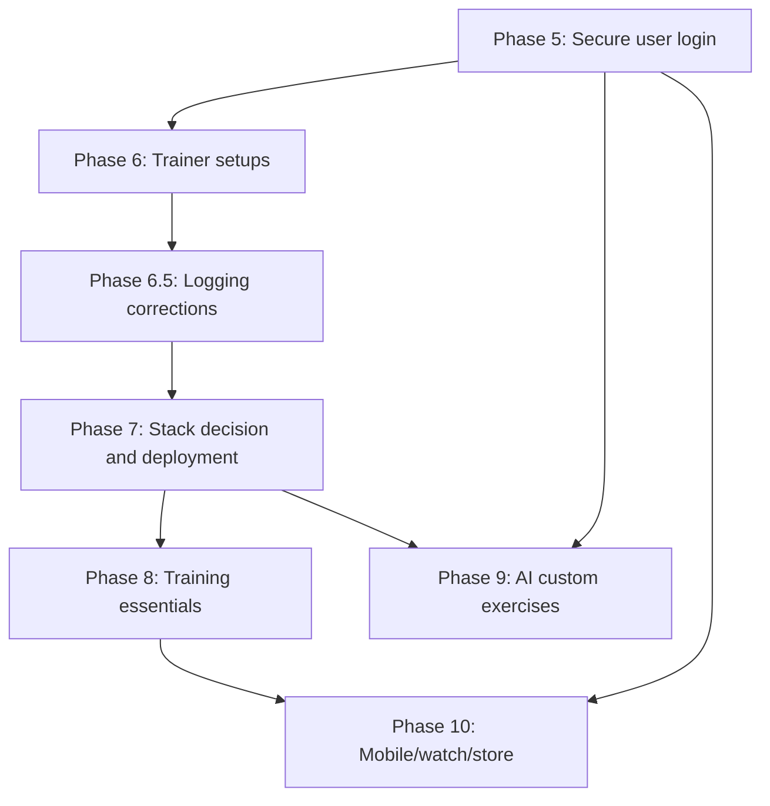

# Roadmap

Technical plan for taking Body Shop from a single-user local Flask app to a hosted,
multi-user product.

This file now tracks only the current, prioritized path forward. The implementation
history and retired tradeoffs live in [ARCHITECTURE.md](ARCHITECTURE.md).

Current state: **Phases 1, 2, 3, 4, and 4.5 are done**, and **Phase 9 was absorbed into
Phase 2**. The app already has Tailwind v4 + daisyUI, 873 exercises with images across
12 muscle groups, Alembic migrations on SQLite/Postgres, per-set weight/reps/RPE, and
the dark instrument-style UI with `/progress`.

## Prioritized roadmap

### 1. Phase 5 — Secure user login

This is the next hard dependency. Everything user-owned depends on it.

- Add ownership to every user data model and query.
- Decide auth with a strong default toward Supabase Auth + bearer tokens.
- Add in-app account deletion and a migration/backfill plan for existing rows.
- Keep the CSRF and cookie-session question aligned with the auth choice.

### 2. Phase 6 — Trainer setups and workout length tuning

Add beginner, experienced, and advanced trainer presets before the rest of the parity
work.

- Beginner starts with a lower sets-per-week target per body part.
- Experienced increases that weekly volume.
- Advanced pushes it higher and unlocks RPE in log-a-workout.
- Brainstorm and implement a way to scale the weekly set target to the workout length
  the user intends to spend.

### 2.5. Phase 6.5 — Minor logging workout corrections

Fix logging edge cases that show the wrong equipment assumption in the workout log.

- Cable exercises should not be reported as a 45 lb bar plus added weight.
- Dumbbells and cables need their own logging/weight wording.
- Add a button that duplicates the set you just entered to make repeat logging faster.
- Keep this scoped to correction work, not a broader logging redesign.

### 3. Phase 7 — Stack decision and deployment

Deploy the current Flask app before adding more product surface.

- Prefer Flask unless a measured constraint forces a rewrite.
- Choose Vercel only if it wins on record; otherwise use a container host.
- Add the launch floor: backups with tested restore, error monitoring, privacy policy,
  and CSV export.
- Keep production gated on the Postgres CI job.

### 4. Phase 8 — Training essentials

This is the parity phase. It should make the app feel complete next to mature trackers.

- Add 1RM estimates, PR detection, per-exercise progress graphs, and body metrics.
- Add entry and set editing.
- Add routines and templates; this is the expensive core of the phase.
- Keep the volume-coverage model intact while adding the parity features.

### 5. Phase 9 — AI-assisted custom exercises

Only build this after the catalog has been in front of real users long enough to show
what it misses.

- Measure the miss rate before building.
- Classify into the existing muscle and facet vocabulary.
- Require user review before saving any AI suggestion.
- Log corrections so the prompt can be tuned against real misses.

### 6. Phase 10 — Mobile, watch, and store distribution

This is last because it consumes the earlier phases.

- Ship a native client or a truly native-capable shell, not a wrapped website.
- Support offline queueing and replay.
- Add watch logging and rest timers.
- Close the store requirements: privacy policy, privacy labels, data safety, and
  account deletion.

## Already shipped

- Phase 1: Tailwind + DaisyUI, CSS-only build step.
- Phase 2: exercise catalog and muscle map, with images folded in.
- Phase 3: Alembic migrations and Postgres support.
- Phase 4: set-level logging, derived volume, previous values, rest timer, plate
  calculator.
- Phase 4.5: dark redesign and the `/progress` training graph.

## Later, if the product earns it

- Auto-progression and programming.
- Social features.
- Nutrition tracking.
- Recovery-aware programming.
- Conversational AI coaching.

## Dependency shape

The live chain is simple:

Phase 5 gates ownership and account deletion. Phase 6 establishes the trainer presets
and the weekly-volume sizing model. Phase 6.5 covers logging corrections around cable
and dumbbell weight display. Phase 7 gates launch. Phase 8 is the competitive parity
floor. Phase 9 depends on actual usage. Phase 10 depends on all of the above.