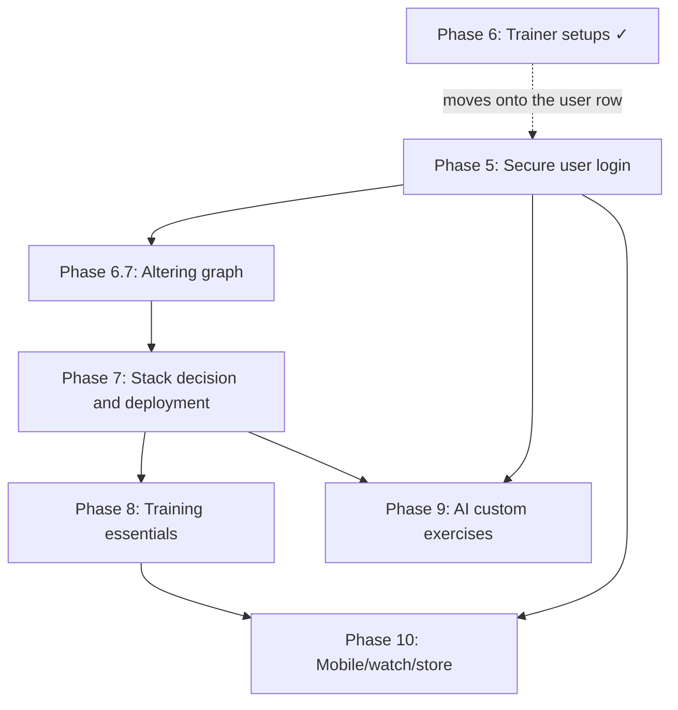

# Roadmap

Technical plan for taking Body Shop from a single-user local Flask app to a hosted,
multi-user product.

This file now tracks only the current, prioritized path forward. The implementation
history and retired tradeoffs live in [ARCHITECTURE.md](ARCHITECTURE.md).

Current state: **Phases 1, 2, 3, 4, 4.5, 6 and 6.5 are done**, and **Phase 9 was
absorbed into Phase 2**. The app already has Tailwind v4 + daisyUI, 873 exercises with
images across 12 muscle groups, Alembic migrations on SQLite/Postgres, per-set
weight/reps/RPE, the dark instrument-style UI with `/progress`, trainer presets that
scale the weekly targets, and equipment-aware logging.

Phase 6 shipped **ahead of** Phase 5, which the dependency graph put first. The trainer
setup needs somewhere per-user to live and there is no user yet, so it lives in
`localStorage` and rides along with the request; Phase 5 moves it onto the user row
without changing the API's shape. That is the only part of the ordering that was
inverted, and it is reversible.

## Prioritized roadmap

### 1. Phase 5 — Secure user login

This is the next hard dependency. Everything user-owned depends on it.

- Add ownership to every user data model and query.
- Decide auth with a strong default toward Supabase Auth + bearer tokens.
- Add in-app account deletion and a migration/backfill plan for existing rows.
- Keep the CSRF and cookie-session question aligned with the auth choice.
- Move the Phase 6 trainer setup off `localStorage` and onto the user row. The API
  already resolves it per request (`experience`/`sessions`/`minutes`), so this is a
  column plus a default, not a reshape.

### 2. Phase 6.7 — Altering graph

Rethink the graph so it keeps becoming more useful as training history accumulates.

- Lift the restriction that the graph only appears after 15 unique workouts.
- Explore a personal-best view that grows denser over time, such as a heat map or
  node-based graph where larger nodes indicate heavier lifts.
- Prefer a visual that gets more detailed and more filled in as the user logs more
  workouts, instead of a static thresholded chart.

### 3. Phase 7 — Stack decision and deployment

Deploy the current Flask app before adding more product surface.

- Prefer Flask unless a measured constraint forces a rewrite.
- Choose Vercel only if it wins on record; otherwise use a container host.
- Add the launch floor: backups with tested restore, error monitoring, privacy policy,
  and CSV export.
- Keep production gated on the Postgres CI job.

### 4. Phase 8 — Training essentials

This is the parity phase. It should make the app feel complete next to mature trackers.

- Add 1RM estimates, PR detection, per-exercise progress graphs, and body metrics.
- Add entry and set editing.
- Add routines and templates; this is the expensive core of the phase.
- Keep the volume-coverage model intact while adding the parity features.

### 5. Phase 9 — AI-assisted custom exercises

Only build this after the catalog has been in front of real users long enough to show
what it misses.

- Measure the miss rate before building.
- Classify into the existing muscle and facet vocabulary.
- Require user review before saving any AI suggestion.
- Log corrections so the prompt can be tuned against real misses.

### 6. Phase 10 — Mobile, watch, and store distribution

This is last because it consumes the earlier phases.

- Ship a native client or a truly native-capable shell, not a wrapped website.
- Support offline queueing and replay.
- Add watch logging and rest timers.
- Close the store requirements: privacy policy, privacy labels, data safety, and
  account deletion.

## Already shipped

- Phase 1: Tailwind + DaisyUI, CSS-only build step.
- Phase 2: exercise catalog and muscle map, with images folded in.
- Phase 3: Alembic migrations and Postgres support.
- Phase 4: set-level logging, derived volume, previous values, rest timer, plate
  calculator.
- Phase 4.5: dark redesign and the `/progress` training graph.
- Phase 6: trainer setups (beginner / experienced / advanced) and workout-length
  sizing, in [app/training.py](../app/training.py). The two inputs combine with
  `min` rather than by multiplying — **your target is the smaller of what your
  experience asks for and what your week can hold** — because training fewer hours
  *is* how a beginner's lower volume shows up, and charging for both double-counts
  it. RPE is the advanced setup's field. Nothing falls below four sets a week, the
  literature's floor for a muscle responding at all.
- Phase 6.5: equipment-aware logging. `weight_mode` is derived from a movement's
  equipment in [app/exercises.py](../app/exercises.py), and it decides what the
  weight column is called, whether a plate breakdown is offered at all, and whether
  the field is asked for. Body-only movements get an "Added weight" toggle instead of
  a weight box, and there is a repeat-set button.

## Later, if the product earns it

- Auto-progression and programming.
- Social features.
- Nutrition tracking.
- Recovery-aware programming.
- Conversational AI coaching.

## Dependency shape

The live chain is simple:

Phase 5 gates ownership and account deletion, and picks up the one loose end Phase 6
left: the trainer setup is a `localStorage` preference sent with each request, and it
becomes a column on the user row. Phase 6.7 rethinks the graph so it fills out as the
log grows. Phase 7 gates launch. Phase 8 is the competitive parity floor. Phase 9
depends on actual usage. Phase 10 depends on all of the above.